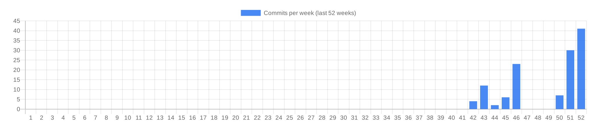

# 🚀 **GenAI Repository - Combined Codebase**

> **This is a combined repository consolidating all project codes for evaluation purposes.** The exact same code is available in separate repositories for detailed exploration. To review individual projects, please visit the separate repositories linked below.

---

## 📋 **Repository Overview**

This repository contains **four distinct, production-ready AI/ML applications** focused on career development, skill advancement, and interview preparation. Each application is independently deployable and serves specific use cases in the talent development ecosystem.

### **Individual Repository Links:**
- 🎯 **PathfinderAI Frontend**: https://github.com/pritamghoshayurmed/pathfinderAi.git
- 💻 **Technical Agent**: https://github.com/pritamghoshayurmed/techinalagent.git
- 🎤 **Behavioral Agent**: https://github.com/pritamghoshayurmed/behavioralagent.git
- 📞 **Career Counselor ADK RAG**: https://github.com/pritamghoshayurmed/ADK_RAG_career-counsellor_mobile_calling_Agent.git

---

## 📁 **Project Structure**

### **1. 🎓 PathfinderAI Frontend** (`pathfinderAi_Frontend/`)
**A comprehensive AI-powered career guidance and skill development platform**

#### **Tech Stack:**
- **Frontend**: React 18 + TypeScript + Vite
- **UI Framework**: Shadcn/ui + Tailwind CSS
- **AI/ML**: Google Gemini API, Google BigQuery, Google Cloud AI
- **Real-time Communication**: LiveKit (video conferencing)
- **Code Editor**: Monaco Editor
- **PDF Generation**: html2canvas + jsPDF
- **SandBox Code Execution**: Piston APi
-

#### **Core Features:**

**📊 Skill Development Dashboard**
- **Skill Gap Analysis**: AI-powered assessment of current vs. required skills with visual roadmaps
- **Interactive Skill Training**: Curated courses with hands-on exercises and progress tracking
- **Career Advisor**: Real-time AI chatbot for career guidance using Gemini API
- **Industry Trends**: Live market analysis powered by BigQuery for trending technologies
- **Projects & Internships**: Curated project recommendations with difficulty levels
- **Interview Prep Hub**: Comprehensive interview preparation with AI-generated questions
- **Placement Kit** (Primary focus):
  - **ATS Scanner**: Resume optimization tool analyzing documents against job descriptions
  - **Resume Builder**: Multi-template resume generator with instant PDF preview (HTML-first approach)
  - **Cover Letter Generator**: AI-powered cover letter creation
  - **Portfolio Builder**: Showcase projects and achievements professionally
  - **Interview Q&A**: AI-generated behavioral and technical questions
  - **ATS History**: Track and compare resume optimization results over time

**🎯 Early Stage Dashboard**
- Aptitude Tests with adaptive difficulty
- Career Explorer with AI-powered pathfinding
- Skill Games for gamified learning
- Study Smart with spaced repetition algorithms
- Wellness & Stress Relief modules
- Progress Intelligence dashboard with analytics

**🔀 Decision-Making Dashboard**
- Career Pathways visualization and recommendations
- Exam Preparation guides (JEE, NEET, CUET, CLAT)
- College Insights with real data
- Alternative Career Explorer
- Mentor Network matching
- Mock Tests with performance analytics
- Progress Analytics with detailed insights

**🏫 College Admission Dashboard**
- College Comparison tool with filtering
- AI-powered Course Matcher
- ROI Calculator for colleges
- What-If Simulator for decision analysis
- Scholarship Finder and tracker
- Application Tracker across multiple colleges

#### **Google AI Technologies Used:**
- ✅ **Google Gemini API** (2.5-flash, Pro models) - LLM backbone
- ✅ **Embeddings API** - Semantic search capabilities

---

### **2. 📞 Career Counselor using LiveKit ADK & RAG** (`career-counsellor_using_livekit_ADK_RAG/`)
**Intelligent career counseling agent with real-time voice calling and RAG-based knowledge retrieval**

#### **Tech Stack:**
- **Backend**: Python + Flask
- **AI Framework**: Google ADK (Agents Development Kit)
- **LLM**: Google Gemini API
- **Voice Communication**: LiveKit + Twilio (SMS integration)
- **Knowledge Retrieval**: FAISS + Gemini Embeddings (RAG pipeline)
- **Document Processing**: Custom chunking and semantic search

#### **Core Features:**

**🤖 Multi-Agent Architecture**
- **Open Positions Agent**: Web research for trending job openings
- **Interview Q&A Agent**: Generates contextual interview questions
- **Interview Tips Agent**: Provides personalized interview guidance
- **Salary Prediction Agent**: Market salary analysis
- **Skill Recommendation Agent**: AI-driven skill suggestions

**📞 Voice Integration**
- Real-time voice conversations using LiveKit
- Twilio SMS notifications for follow-ups
- Mobile-optimized calling experience
- Automatic call recording and transcription

**🧠 RAG System Features**
- **Low-latency FAISS indexing** for semantic search
- **Gemini Embeddings** for high-quality document representation
- **Cached embeddings** for reduced API calls
- **Intelligent chunking** by section headers and content similarity
- **Production-optimized** for minimal latency

**📊 Knowledge Base**
- Career development frameworks
- Interview preparation guides
- Industry trends and insights
- Salary benchmarks
- Skill pathway recommendations

#### **Google AI Technologies Used:**
- ✅ **Google ADK** - Agentic AI framework
- ✅ **Gemini API** - Multi-turn conversations and embeddings
- ✅ **RAG Architecture** - Knowledge-grounded responses
- ✅ **Gemini Embeddings** - Semantic search
- ✅ **Parallel Agent Execution** - Multi-task processing

---

### **3. 🎤 Behavioral Interview Agent** (`behavioralagent_BehaviouralinterviewRound/`)
**AI-powered behavioral interview simulator with voice interaction**

#### **Tech Stack:**
- **Backend**: Python + LiveKit Agents SDK
- **Speech-to-Text**: Deepgram Nova-3 (multilingual)
- **Text-to-Speech**: Speechify multilingual
- **LLM**: Google Gemini
- **Noise Cancellation**: LiveKit noise suppression

#### **Core Features:**

**🎯 Behavioral Interview Capabilities**
- Realistic behavioral question sequences
- Real-time conversation flow management
- Contextual follow-up questions
- Performance evaluation and feedback
- Support for multiple languages
- Noise-cancellation for better audio quality

**🔧 Tools Integration**
- URL opener for resource access
- Career resource fetcher
- Context-aware recommendations
- Real-time knowledge retrieval

**📈 Interview Simulation**
- Role-based interviewer personas
- STAR method evaluation
- Response quality assessment
- Feedback generation using Gemini

#### **Google AI Technologies Used:**
- ✅ **Google Gemini LLM** - Conversational AI backbone
- ✅ **Multimodal Processing** - Text and speech handling

---

### **4. 💻 Technical Interview Agent** (`techinalagent_BehaviouralinterviewRound/`)
**AI-powered technical interview conductor with code review capabilities**

#### **Tech Stack:**
- **Backend**: Python + LiveKit Agents SDK
- **Speech-to-Text**: Groq Whisper Large v3 (multilingual)
- **Text-to-Speech**: Cartesia Sonic-3
- **LLM**: OpenAI GPT-4.1-mini
- **Code Analysis**: Real-time parsing and evaluation

#### **Core Features:**

**👨‍💻 Technical Interview Capabilities**
- Code solution review and analysis
- Algorithm complexity evaluation (time/space)
- Follow-up questioning on approach and design
- Edge case identification and testing
- Alternative solution exploration
- Conversational guidance with subtle hints
- Real-time code walkthrough
- Design pattern recognition

**🔍 Evaluation Metrics**
- Problem-solving approach assessment
- Algorithm optimization knowledge
- Data structure utilization
- Software engineering principles
- Code quality and readability

**💡 Feedback Loop**
- Constructive feedback generation
- Misconception correction
- Suggestion for improvement areas

---

## 🌐 **Key Technologies Across All Projects**

### **Google AI Stack:**
| Technology | Usage |
|-----------|-------|
| **Gemini API** | Core LLM for all conversational features |
| **Google ADK** | Agentic AI framework for career counselor |
| **Google BigQuery** | Analytics and data insights |
| **Gemini Embeddings** | Semantic search and RAG retrieval |
| **Google Cloud AI** | NLP and document processing |

### **Communication & Real-time:**
| Technology | Usage |
|-----------|-------|
| **LiveKit** | Real-time audio/video communication |
| **Deepgram** | Advanced speech recognition |
| **Twilio** |On call carrier Guidence in multiple Languages |
| **Cartesia Sonic** | High-quality text-to-speech |

### **Data & Search:**
| Technology | Usage |
|-----------|-------|
| **FAISS** | Vector indexing and similarity search |
| **RAG Pipeline** | Knowledge-grounded AI responses |

---

## 🚀 **Quick Start Guide**

### **PathfinderAI Frontend**
```bash
cd pathfinderAi_Frontend
npm install
npm run dev
```

### **Career Counselor ADK RAG**
```bash
cd career-counsellor_using_livekit_ADK_RAG
pip install -r requirements.txt
python adk_agents.py start
```

### **Behavioral Agent**
```bash
cd behavioralagent_BehaviouralinterviewRound
pip install -r requirements.txt
python behavioural_agent.py start
```

### **Technical Agent**
```bash
cd techinalagent_BehaviouralinterviewRound
pip install -r requirements.txt
python agent.py start
```

---

## 📊 **Feature Comparison Matrix**

| Feature | PathfinderAI | Career Counselor | Behavioral | Technical |
|---------|-------------|-----------------|-----------|-----------|
| **Voice Integration** | ✅ | ✅ | ✅ | ✅ |
| **Resume Building** | ✅ | ❌ | ❌ | ❌ |
| **Real-time Chat** | ✅ | ✅ | ❌ | ❌ |
| **Interview Simulation** | ✅ | ✅ | ✅ | ✅ |
| **Code Analysis** | ✅ | ❌ | ❌ | ✅ |
| **RAG Knowledge Base** | ❌ | ✅ | ❌ | ❌ |
| **Multi-agent System** | ❌ | ✅ | ❌ | ❌ |
| **Dashboard Analytics** | ✅ | ❌ | ❌ | ❌ |

---

## 👥 **Collaborators**

| Name | Role | Repository | Email |
|------|------|-----------|-------|
|Pritam Ghosh|Data Science(Gen AI, AI Agent Developer)|All Repositories(Pathfinder_frontend{skill development dashboard(Placement Kit,interview rounds,Trending skills)}) |gpritam414@gmail.com|
|Ankit Rajak|Database Administrator and Full Stack Developer|PathfinderAI(Skill Development & Decision Making Dashboard)|ankit12rajak@gmail.com|
|Koushik Das|Full Stack Developer|PathfinderAi(College Admission Dashboard)|koushikkd07@gmail.com|
|Nabin Bera|Full Stack & Devops Engineer|PathfinderAI(Early Stage Dashboard)|nabinbera999@gmail.com|
|Om Prasad|Frontend Developer & UI/UX Designer|PathfinderAi|omprasad1274@gmail.com|
```md
## Contributions (commit activity) — specific repo

This image is auto-generated by Actions and shows weekly commits for the target repository.



# How to generate (one-off)

1. Go to Actions > generate-contrib-graph and click "Run workflow".
2. Provide the input "target_repo" (format: owner/repo), e.g. `pritamghoshayurmed/pathfinderAi`.
3. The workflow will create/update the SVG under assets/ and commit it to this repo.
4. The image above will show the latest generated graph.

# Embedding another repo chart

If you generated a chart for `ownerX/repoY` the SVG filename will be:
`assets/contrib-ownerX-repoY.svg`

You can add this Markdown to any README to display it:

```md

```

---

## 📝 **Project Documentation**

Each folder contains:
- ✅ `README.md` - Specific project documentation
- ✅ `requirements.txt` - Python dependencies
- ✅ `package.json` - Node.js dependencies (Frontend)
- ✅ `Dockerfile` - Container configuration
- ✅ Source code with inline documentation

---

## 🔗 **Environment Variables Required**

### **All Projects:**
```
GEMINI_API_KEY=<your-google-api-key>
```

### **Career Counselor ADK:**
```
LIVEKIT_URL=<your-livekit-url>
LIVEKIT_API_KEY=<your-livekit-key>
TWILIO_ACCOUNT_SID=<your-twilio-sid>
TWILIO_AUTH_TOKEN=<your-twilio-token>
```

### **Interview Agents:**
```
LIVEKIT_URL=<your-livekit-url>
LIVEKIT_API_KEY=<your-livekit-key>
DEEPGRAM_API_KEY=<for-behavioral-agent>
```

---

## 🎯 **Key Highlights**

### **For Evaluators:**
1. **Integrated Platform** - All four projects work together to create a complete career development ecosystem
2. **Google AI-First** - Heavy use of latest Google AI technologies (Gemini, ADK, BigQuery)
3. **Production Ready** - All code follows industry best practices with error handling and optimization
4. **Scalable Architecture** - Modular design allows independent scaling and updates
5. **Real-time Capabilities** - Voice, video, and instant messaging throughout
6. **Enterprise Features** - RAG, multi-agent systems, analytics dashboards

### **Unique Features:**
- 🏆 **Skill Development Dashboard** with ATS scanning and multi-template resume generation
- 🤖 **Multi-agent Career Counselor** powered by Google ADK
- 🎙️ **Interactive Interview Simulations** (Technical & Behavioral)
- 📊 **Advanced Analytics** with BigQuery integration

---

## 📄 **License**

All projects are proprietary. See individual repositories for details.

---

## 📞 **Support**

For issues or questions regarding individual projects, please refer to their respective repositories or contact the development team.

---

**Last Updated**: November 2, 2025  
**Repository Status**: ✅ Active & Maintained
